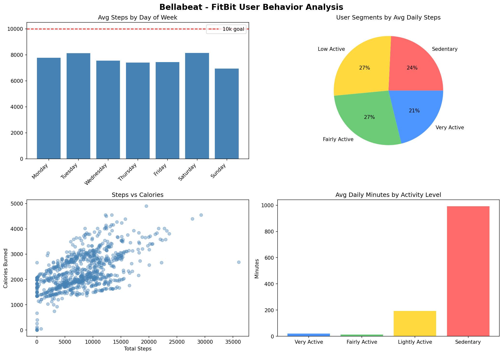
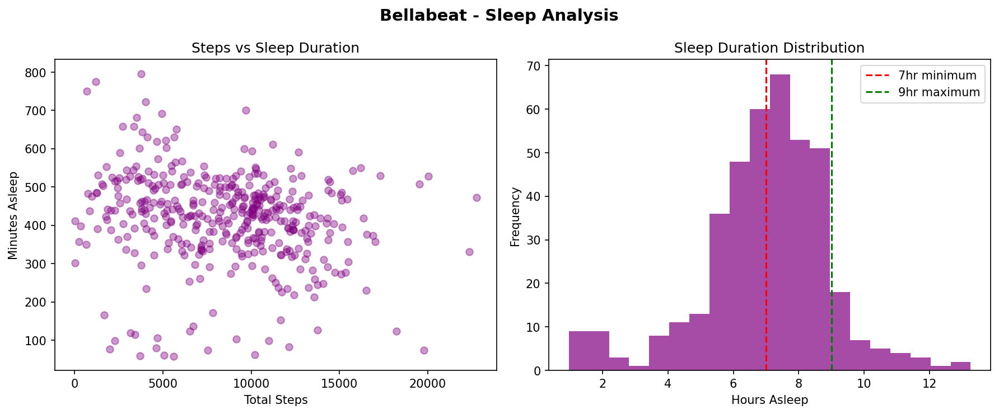

# Bellabeat Case Study — Google Data Analytics Capstone

## Overview
Analysis of FitBit fitness tracker data to uncover smart device usage trends 
and provide data-driven marketing recommendations for Bellabeat, a women's 
wellness technology company.

**Tools used:** Python (pandas, matplotlib, seaborn) | Google Colab

---

## Key Findings
| Finding | Insight |
|---|---|
| Avg daily steps | 7,638 — below the 10,000 WHO recommendation |
| Sedentary time | 16.5 hrs/day — major engagement opportunity |
| Sleep tracking | Only 24 of 33 users use the sleep feature |
| Awake in bed | 39 mins average — wind-down gap |
| Peak activity | Tuesday & Saturday; lowest on Sunday |

---

## Visualizations

---

## Recommendations for Bellabeat
1. **Movement reminders** — hourly nudges during sedentary hours via Leaf/Time
2. **Adaptive step goals** — personalized targets instead of fixed 10k
3. **Sleep feature push** — in-app prompts to increase sleep tracking adoption
4. **Wind-down mode** — evening breathing reminders and bedtime notifications
5. **Sunday Reset challenge** — weekly campaign to boost lowest-activity day

---

## Dataset
[FitBit Fitness Tracker Data](https://www.kaggle.com/datasets/arashnic/fitbit) 
— 33 users, April–May 2016, via Kaggle (CC0 Public Domain)
